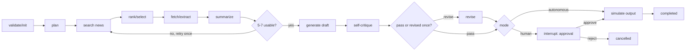

# Newsletter Agent - Implementation Plan

## 1. Assignment requirements (complete extraction)

### Objective

Build a mini autonomous AI **Newsletter Agent**.

### Required input and behaviour

- Accept a plain-English goal, demonstrated with: `Create a weekly newsletter on latest AI agent news and send it to our subscribers.`
- Autonomously research current AI-agent news using a public API, search tool, or scraping approach.
- Select and summarize the top **5-7** relevant articles.
- Produce a clean newsletter in HTML or Markdown.
- Simulate sending by saving a file or displaying the email subject and content.
- Expose one orchestration call, e.g. `run_newsletter_agent(goal)`, that completes the full workflow.

### Core requirements

- Multi-step reasoning/workflow: planning -> research -> writing -> review -> output.
- Demonstrate at least **2-3 tools** (examples in brief: web search, summarizer, HTML generator).
- Include self-reflection/critique and improve the output from that critique.
- Toggle between **Fully Autonomous** and **Human-in-the-Loop** modes.
- Use LangChain or pure LangGraph.
- Use any supported hosted/local LLM (Gemini, Grok, Claude, OpenAI, Ollama).
- Provide a simple frontend for interacting with the agent.
- Keep code clean, well structured, and readable.

### Implied evaluation priorities

The brief does not provide a scoring rubric. The demonstrable criteria are: genuinely autonomous end-to-end execution, visible multi-step process and tool calls, grounded article selection, meaningful critique/revision, both modes working, clean output, and code quality.

### Not required

- A real email provider, subscriber database, scheduler, authentication, long-term storage, vector database, multi-agent system, or production email delivery.
- These should not be built for this one-day assignment. Email is explicitly a simulation.

## 2. Relevant findings from prior projects

### Meera Chatbot (`Utkarsh9571/meera-chatbot`)

- **Architecture:** Express API backend, MongoDB/Mongoose persistence, vanilla HTML/JS frontend; Vercel frontend and Render backend deployment.
- **LLM usage:** Gemini through a small lazy-initialized service (`generateText`). The model is deliberately constrained to natural-language expression while deterministic Node logic controls the business flow.
- **Workflow/state:** Lead extraction and a fixed next-step state machine produce predictable progression. Conversation, lead fields, scores, handovers, and messages persist in MongoDB.
- **Error handling:** route-level try/catch, input validation, status codes, and defensive fallbacks around optional DB/context lookups.
- **Human control/self-improvement:** admin corrections become versioned active prompt rules with rollback support.
- **Deployment:** environment-driven secrets and independently deployable frontend/API.
- **LangGraph:** no LangChain or LangGraph dependency/use was found. This project demonstrates an explicit deterministic state machine, not LangGraph.

Useful transfer: keep the agent's control flow deterministic and observable; use the LLM for structured planning, synthesis, and critique rather than allowing an unbounded chat loop; handle missing sources/API failures gracefully.

### MailPilot (`Utkarsh9571/mailpilot`)

- **Architecture:** Next.js App Router + TypeScript; components, typed action functions, API routes, service layer, Zustand stores, and shadcn/Tailwind UI.
- **LLM/agent use:** Gemini via CopilotKit. The LLM invokes named UI actions; it does not manipulate the DOM. Context is exposed through typed readable state.
- **Tool/action pattern:** isolated action functions (`compose`, `search`, `archive`, `send`, etc.) update Zustand state and are observable in the UI.
- **State/HITL:** assistant store holds a pending action and action log; a modal requires approval before sending email.
- **Error handling:** UI toasts, action logging, API response checks, and try/catch around real integration calls.
- **External service strategy:** Gmail has a mock mode that lets an evaluator run the core experience without OAuth credentials; live OAuth is optional.
- **Quality/deployment:** Vitest tests, Next.js configuration, and a documented environment/setup path.
- **LangGraph:** no LangChain or LangGraph dependency/use was found. CopilotKit function calling is the agent-control mechanism.

Useful transfer: reuse the Next.js/TypeScript/Zustand/shadcn shape, make each workflow action visible, retain a run log, and treat sending/output as an approval-gated side effect. Build a no-key/mock fallback where it improves evaluator experience.

## 3. Recommended technical decision

### Use LangGraph: yes, but minimally

Use **LangGraph JS** because the assignment explicitly asks for LangChain or pure LangGraph and the work is a bounded, stateful workflow with a real approval checkpoint. A graph makes planning, tool-driven research, critique/revision, failure handling, and Human-in-the-Loop interruption explicit and easy to demo.

Do **not** build a free-form ReAct swarm, subagents, persistence/checkpoint infrastructure, or a general task planner. A small, deterministic graph is both more reliable today and better aligned with the Meera pattern.

### Stack

- **Next.js + TypeScript + App Router** - fastest fit with MailPilot and one deployable app.
- **LangGraph JS** + `@langchain/google-genai` - Gemini 2.5 Flash/Flash-Lite for structured output and low latency/cost.
- **Zod** - schemas for planner, article summaries, critique, and final result.
- **Zustand** - client-only run state, step status, approval request, result, and event log.
- **Tailwind + existing/simple shadcn-style primitives** - polished but small UI.
- **NewsAPI.org** as the preferred research search tool if key is supplied; **Google News RSS** as a keyless fallback.
- Native `fetch` + HTML extraction (`cheerio`) - fetch article pages and extract readable text as the second research tool.
- Local file download/API response for email simulation. No database, auth, Gmail OAuth, scheduler, or Docker is needed.

### API/service choices

| Service | Needed? | Purpose | Fallback / avoid |
| --- | --- | --- | --- |
| Gemini API key | Yes for live AI | planning, source ranking, summaries, newsletter, critique/revision | Optional demo fixtures can make UI inspectable, but live assignment requires an LLM key. |
| NewsAPI key | Preferred, optional | recent article search with dates, URLs, source metadata | Google News RSS query requires no key. |
| Article websites | Yes at runtime | retrieve primary article text for grounded summaries | If retrieval fails, use search snippet and label the source as snippet-only; omit weak sources. |
| Email/SMTP/Resend/Gmail | No | assignment requires only simulation | render preview + downloadable `.html`; optionally log a simulated send record. |
| Database/auth/vector DB | No | not needed for a single run | use graph state/server response and Zustand. |
| Deployment | Yes at handoff | Vercel | one Next.js app; configure env vars in Vercel. |

## 4. Complete agent workflow

`runNewsletterAgent(input)` is the server-side entry point. It accepts `{ goal, mode, approval? }` and invokes the graph.

1. **Validate and initialize** - reject empty/oversized goals; create `runId`, timestamps, default audience/tone, and event log.
2. **Plan** - Gemini returns structured plan: topic/search queries, date window (last 7 days by default), intended audience, desired article count (5-7), and newsletter angle. Clamp count to 5-7 and queries to 2-3.
3. **Search news (tool 1)** - execute 2-3 queries through NewsAPI or Google News RSS. Normalize results, discard missing URLs, deduplicate canonical URLs/titles, and retain publication dates.
4. **Rank/select** - LLM chooses 7-10 candidates based on AI-agent relevance, recency, source diversity, and novelty. Deterministic rules reject sources older than the plan window unless too few results exist.
5. **Fetch/extract articles (tool 2)** - retrieve selected URLs in parallel with short timeout; extract title/byline/body text. Keep a per-source retrieval error rather than failing the entire run.
6. **Summarize (tool 3 / LLM structured operation)** - Gemini creates grounded structured summaries: headline, 2-3 sentence summary, why it matters, URL, publisher/date, and evidence excerpt. Exclude inaccessible/low-information items. If fewer than five are usable, return to search once with broadened queries.
7. **Generate newsletter** - Gemini produces subject line, preview text, intro, 5-7 sections, and a concise closing as structured content; server renders this data using a deterministic HTML template. Never ask the LLM to invent raw HTML styles.
8. **Self-critique** - a separate structured Gemini call evaluates: article count, recency, source URLs, factual grounding against summaries, duplication, scanability, tone, subject quality, and unsupported claims. It returns `pass`, numeric score, and actionable revision instructions.
9. **Revise once if needed** - when critique is not a pass/score below threshold, regenerate only the affected editorial content using critique + prior content. Do not re-research unless source validity is the issue.
10. **Human-mode checkpoint or autonomous output**:
    - **Fully Autonomous:** directly create the simulated send result.
    - **HITL:** LangGraph interrupts immediately before output with immutable preview payload. The UI shows subject/recipient count/newsletter preview and Approve/Reject buttons. Approve resumes; reject ends as `cancelled` without output.
11. **Simulate send/output** - create result metadata (`status: simulated_sent`, timestamp, subject, recipient count placeholder), provide rendered HTML and a downloadable file. UI shows the final newsletter and run timeline.

## 5. Graph state and transitions

### State schema

```ts
type NewsletterAgentState = {
  runId: string;
  goal: string;
  mode: "autonomous" | "human";
  status: "running" | "awaiting_approval" | "completed" | "cancelled" | "failed";
  plan?: NewsletterPlan;
  searchResults: SearchResult[];
  selectedCandidates: SearchResult[];
  articles: CollectedArticle[];
  summaries: ArticleSummary[];
  draft?: NewsletterDraft;
  critique?: NewsletterCritique;
  finalNewsletter?: NewsletterDraft;
  output?: SimulatedSendResult;
  errors: AgentError[];
  events: AgentEvent[];
  revisionCount: number; // capped at 1
};
```

`AgentEvent` records time, node, action/tool, status, compact input/result detail, and non-sensitive error text. It is the visual proof of autonomous tool use.

### Transition diagram



### Error/loop policy

- Search failure: try the fallback search provider once; otherwise return a clear failed state.
- Per-article fetch failure: log and continue; do not invent content.
- Fewer than 5 usable summaries: one broader research retry, then fail with an actionable "insufficient sources" message rather than outputting an invalid newsletter.
- LLM malformed output: use Zod validation and one repair retry with the validation error; fail cleanly thereafter.
- Critique/revision: exactly one revision pass prevents loops and makes runtime predictable.
- HITL rejection: no output file/send record is created.

## 6. UI and interaction design

One desktop-first responsive page, deliberately smaller than MailPilot:

- Header: product name, short "LangGraph-powered" label, mode segmented toggle.
- Input card: prefilled assignment goal, Run agent button, optional "Use demo data" development-only switch.
- Run timeline: visible nodes/tool calls, durations, result counts, and errors. This is central to the evaluation.
- HITL approval card: shown only after draft completion in Human mode; subject, article count, HTML preview, Approve simulated send / Reject.
- Output panel: subject, preview text, rendered newsletter, source links, critique score and changes applied, simulated email metadata, Download HTML.
- Loading/empty/error states and disabled controls while a run is active.

Do not add sign-in, a rich email composer, inbox, history dashboard, or persisted run management.

## 7. File-by-file implementation plan

Assume a fresh Next.js TypeScript App Router project named `newsletter-agent`.

| File | Responsibility |
| --- | --- |
| `package.json` | Add Next/React, LangGraph/LangChain Gemini packages, Zod, Zustand, Cheerio, RSS parser, Tailwind/shadcn essentials; scripts for dev/build/lint/test. |
| `.env.example` | Document `GEMINI_API_KEY`, optional `NEWS_API_KEY`, `NEWS_PROVIDER=newsapi|rss`, and optional `NEXT_PUBLIC_SIMULATED_RECIPIENT_COUNT`. Never commit real values. |
| `README.md` | Problem statement, architecture diagram, workflow, tool list, modes, setup, keyless RSS fallback, testing, limitations, and deployed URL placeholder. |
| `src/app/layout.tsx` | Metadata and app shell. |
| `src/app/page.tsx` | Compose the client dashboard; no agent logic. |
| `src/app/globals.css` | Small visual system for timeline, status, newsletter preview, responsive layout. |
| `src/app/api/newsletter/run/route.ts` | Validate request, call `runNewsletterAgent`, return final/interrupt response. Keep API key server-only. |
| `src/app/api/newsletter/resume/route.ts` | Resume the interrupted HITL graph with approval decision. Use an in-memory run/checkpoint map only for this task; communicate its single-instance limitation in README. |
| `src/app/api/newsletter/download/route.ts` | Return newsletter HTML as `text/html` attachment after validating run ID/result. Could be omitted if client uses Blob download; choose one approach only. |
| `src/lib/env.ts` | Server-only environment parsing and helpful missing-key error. |
| `src/lib/agent/types.ts` | Zod schemas and inferred TS types for all input, source, summary, plan, critique, draft, event, and output records. |
| `src/lib/agent/state.ts` | LangGraph annotation/state reducer definitions and initial-state factory. |
| `src/lib/agent/prompts.ts` | Small focused prompts for plan, selection, summary, draft, critique, and revision. Require URLs, no fabricated facts, concise output, JSON schema compliance. |
| `src/lib/agent/llm.ts` | Create Gemini chat model once; expose structured-output helpers with model choice from env. |
| `src/lib/agent/tools/news-search.ts` | `searchNews` tool implementation with NewsAPI primary and Google News RSS fallback, normalization/deduplication/date filtering. |
| `src/lib/agent/tools/article-fetch.ts` | `fetchArticle` tool with timeout, user agent, HTML cleanup, main-text extraction, character cap, and typed recoverable errors. |
| `src/lib/agent/tools/render-newsletter.ts` | Deterministic newsletter HTML renderer from typed draft data; escaping and safe link attributes. This is the third visible tool/action. |
| `src/lib/agent/nodes.ts` | Pure graph nodes: initialize, plan, research, select, collect, summarize, draft, critique, revise, approval, simulateSend. Each appends events/errors. |
| `src/lib/agent/graph.ts` | Compile graph, conditional edges/retry caps, `interruptBefore: ["simulateSend"]` for human mode, in-memory checkpointer, and exported `runNewsletterAgent` / `resumeNewsletterAgent`. |
| `src/store/newsletter-store.ts` | Zustand UI state: form, mode, request state, active run result, approval payload, error; async calls to run/resume endpoints. |
| `src/components/goal-form.tsx` | Goal input, mode toggle, submit/reset controls and validation messages. |
| `src/components/run-timeline.tsx` | Event log with nodes, tools, state, durations and compact error display. |
| `src/components/approval-card.tsx` | Human-mode preview and approve/reject action; clearly label the action as simulated. |
| `src/components/newsletter-preview.tsx` | Subject/preview/HTML newsletter rendering, source list, critique/revision information, download control. |
| `src/components/status-badge.tsx` | Shared run/node status UI. |
| `src/lib/agent/__tests__/tools.test.ts` | Unit test result normalization, deduplication, date filtering, article extraction fallbacks, and renderer escaping. |
| `src/lib/agent/__tests__/graph.test.ts` | Mock LLM/search/fetch; verify node order, tool events, critique-triggered single revision, autonomous completion, HITL interruption/approval/rejection, and failure when usable sources <5. |
| `src/components/__tests__/dashboard.test.tsx` | Mode toggle and HITL approval UI state behaviour. |
| `TESTING.md` | Manual demo script for both modes, expected evidence, API failure tests, and pre-submission checklist. |
| `vercel.json` (only if required) | Set function runtime/region only if deployment testing shows a need; otherwise omit. |

## 8. One-day implementation sequence

1. **Foundation (45-60 min):** scaffold, dependencies, env, types, Gemini helper, UI shell.
2. **Agent core (2-2.5 hr):** research tools, article extraction, structured prompts, graph/nodes, deterministic renderer.
3. **Modes and UI (1.5-2 hr):** API routes, Zustand state, timeline, preview, approval/resume flow.
4. **Reliability/demo (1.5-2 hr):** mocks, tests, error states, manual test runs with fresh news, README/screenshots.
5. **Deploy/submission (30-60 min):** Vercel env configuration, production smoke test in both modes, final repository cleanup.

## 9. Definition of done

- A user can paste the provided goal and complete an autonomous run in one click.
- The UI visibly shows planning, at least three tools/actions, research sources, summaries, draft, critique, revision decision, and simulated output.
- The final newsletter contains 5-7 grounded, linked, recent articles.
- Fully Autonomous mode completes without user intervention.
- Human mode pauses before simulation and only completes after approval; reject safely cancels.
- Missing keys, failed searches, failed article fetches, invalid model output, and too-few sources have clear non-crashing behaviour.
- `npm run lint`, `npm run test:run`, and `npm run build` pass before deployment.
